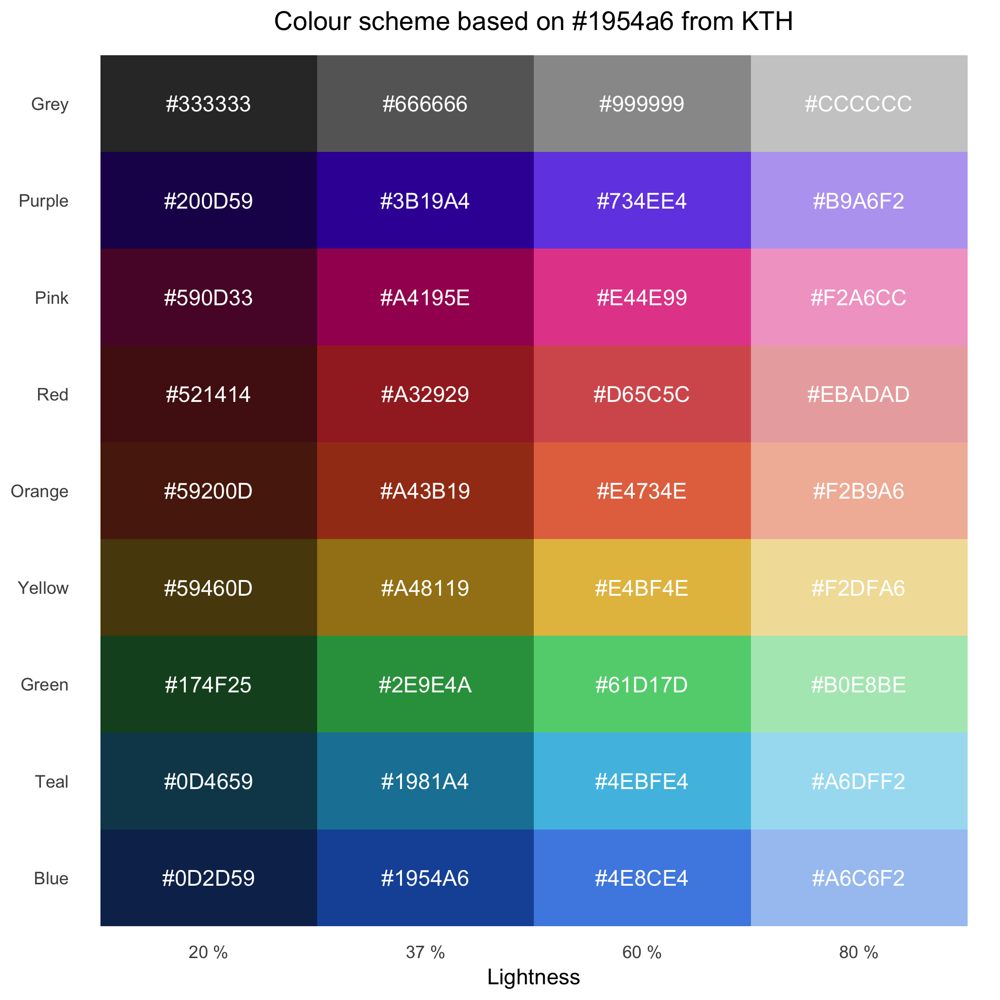

# Colours

[![License: MIT][1]][2]

This is a simple colour palette based on the blue of KTH Royal Institute of
Technology. RGB hexes for several colours and grades of lightness are listed
and visualised, with the aim to be both visually pleasing and distinct.

    

[1]: https://img.shields.io/badge/License-MIT-blue.svg
[2]: https://opensource.org/licenses/MIT
